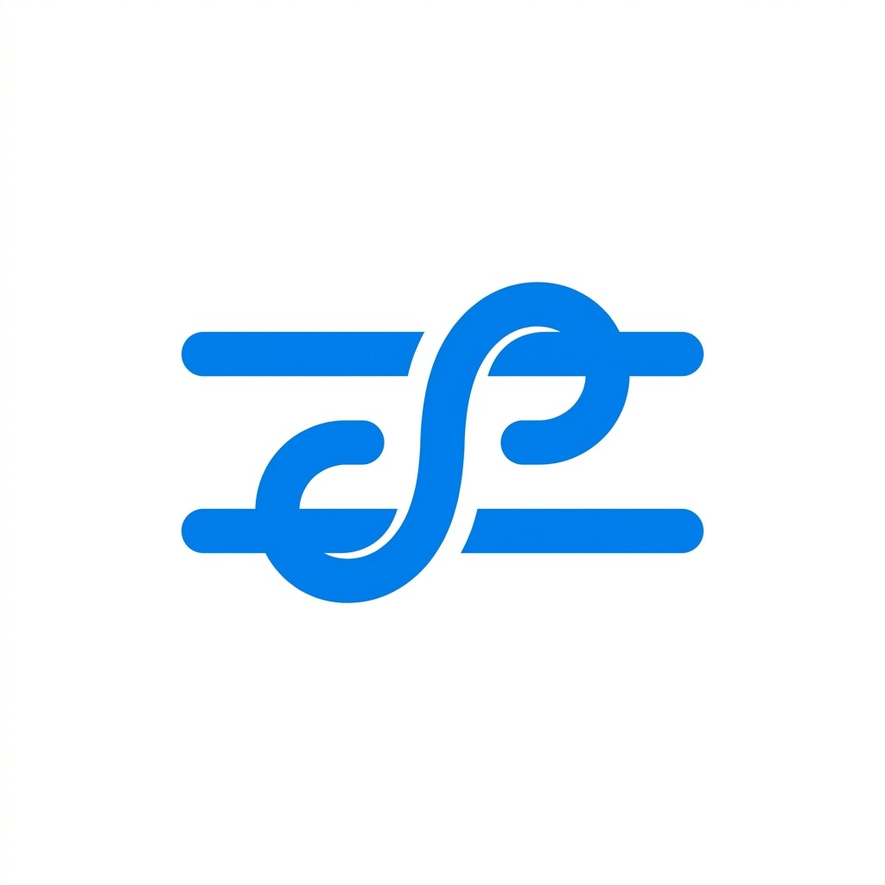
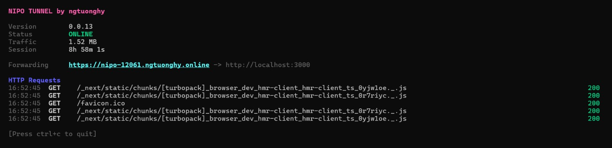

<a name="readme-top"></a>

<!-- PROJECT SHIELDS -->
<div align="center">

[![Contributors][contributors-shield]][contributors-url]
[![Forks][forks-shield]][forks-url]
[![Stargazers][stars-shield]][stars-url]
[![Issues][issues-shield]][issues-url]
[![MIT License][license-shield]][license-url]

</div>

<!-- PROJECT LOGO -->
<br />
<div align="center">
  <a href="https://github.com/ngtuonghy/nipo-tunnel">
    
  </a>

<h3 align="center">NIPO TUNNEL</h3>

  <p align="center">
    Công cụ tạo HTTP tunnel bảo mật từ local ra internet hoàn toàn miễn phí. Sử dụng mạng lưới Cloudflare - không cần tài khoản, không cần cấu hình.
    <br />
    <br />
    <a href="../README.md"><strong>English</strong></a>
    <br />
    <br />
    <a href="https://github.com/ngtuonghy/nipo-tunnel">Xem Demo</a>
    ·
    <a href="https://github.com/ngtuonghy/nipo-tunnel/issues">Báo lỗi</a>
    ·
    <a href="https://github.com/ngtuonghy/nipo-tunnel/issues">Yêu cầu tính năng</a>
  </p>
</div>

<div align="center">
  
</div>

<!-- TABLE OF CONTENTS -->
<details>
  <summary>Mục lục</summary>
  <ol>
    <li>
      <a href="#về-dự-án">Về Dự án</a>
      <ul>
        <li><a href="#công-nghệ-sử-dụng">Công nghệ sử dụng</a></li>
      </ul>
    </li>
    <li>
      <a href="#bắt-đầu">Bắt đầu</a>
      <ul>
        <li><a href="#yêu-cầu-hệ-thống">Yêu cầu hệ thống</a></li>
        <li><a href="#cài-đặt">Cài đặt</a></li>
      </ul>
    </li>
    <li><a href="#cách-dùng">Cách dùng</a></li>
    <li><a href="#khắc-phục-sự-cố--faq">Khắc phục sự cố & FAQ</a></li>
    <li><a href="#lộ-trình-phát-triển">Lộ trình phát triển</a></li>
    <li><a href="#đóng-góp">Đóng góp</a></li>
    <li><a href="#giấy-phép">Giấy phép</a></li>
    <li><a href="#liên-hệ">Liên hệ</a></li>
    <li><a href="#lời-cảm-ơn">Lời cảm ơn</a></li>
  </ol>
</details>


<!-- ABOUT THE PROJECT -->
## Về Dự án

Nipo là công cụ CLI nhẹ giúp đưa server local của bạn lên public internet ngay lập tức.

### Tính năng chính
* **Giao diện TUI tương tác**: Hiển thị băng thông, trạng thái kết nối và log theo thời gian thực.
* **Đa Tunnel**: Mở nhiều port cùng lúc thông qua file cấu hình `nipo.yml`.
* **Cài đặt tự động**: Tự động tải xuống `cloudflared` daemon gốc trong lần chạy đầu tiên.

<p align="right">(<a href="#readme-top">quay lại đầu trang</a>)</p>


### Công nghệ sử dụng

* [![Go][Go-badge]][Go-url]
* [![Node.js][Node-badge]][Node-url]
* [![Cloudflare Workers][Cloudflare-badge]][Cloudflare-url]
* [![Charm][Charm-badge]][Charm-url]

<p align="right">(<a href="#readme-top">quay lại đầu trang</a>)</p>


<!-- GETTING STARTED -->
## Bắt đầu

Làm theo các bước sau để cài đặt và sử dụng Nipo.

### Yêu cầu hệ thống

* **Node.js** (phiên bản 14 trở lên) - được dùng để cài đặt gói binary toàn cục.

### Cài đặt

Cài đặt Nipo global thông qua npm:

```bash
npm install -g nipo-tunnel
```

### Gỡ cài đặt

Để gỡ bỏ hoàn toàn Nipo Tunnel và cấu hình của nó khỏi hệ thống:

```bash
# 1. Gỡ gói npm
npm uninstall -g nipo-tunnel

# 2. Xóa cấu hình và file thực thi lõi
# Trên Windows (PowerShell)
Remove-Item -Recurse -Force ~/.nipo
# Trên Mac/Linux
rm -rf ~/.nipo
```

<p align="right">(<a href="#readme-top">quay lại đầu trang</a>)</p>


<!-- USAGE EXAMPLES -->
## Cách dùng

### 1. HTTP Tunneling
Để chuyển tiếp public traffic về một port local (ví dụ: port 3000):
```bash
nipo http 3000
```

### 2. Custom Subdomains
Khởi chạy tunnel với một subdomain tùy chỉnh:
```bash
nipo http 3000 --subdomain myapp
# Hoặc viết tắt:
nipo http 3000 -s myapp
```

### 3. Chạy nhiều tunnel cùng lúc (thông qua nipo.yml)
Bạn có thể định nghĩa nhiều tunnel trong một file cấu hình cục bộ có tên `nipo.yml`:
```yaml
default_subdomain: "myproject"
tunnels:
  - name: web
    port: 3000                     # Sử dụng default subdomain: myproject-web
  - name: api
    port: 8080
    subdomain: "my-custom-api"  # Ghi đè và sử dụng: my-custom-api
```
* **Khởi chạy tất cả tunnel cùng lúc**:
  ```bash
  nipo start
  ```
* **Khởi chạy một tunnel cụ thể từ file cấu hình**:
  ```bash
  nipo start web
  ```

### 4. Cấu hình & Tùy chọn Ngôn ngữ
Kiểm tra cấu hình hiện tại:
```bash
nipo config
```
Nipo tự động nhận diện ngôn ngữ hệ thống của bạn, nhưng bạn có thể thay đổi ngôn ngữ hiển thị động bằng lệnh:
```bash
nipo config --language vi  # Chuyển sang Tiếng Việt
nipo config --language en  # Chuyển sang Tiếng Anh
```
Những tuỳ chọn này được lưu mặc định ở `~/.nipo/config.yml`.

<p align="right">(<a href="#readme-top">quay lại đầu trang</a>)</p>


<!-- TROUBLESHOOTING & FAQ -->
## Khắc phục sự cố & FAQ

### Xử lý xung đột Subdomain
Nếu subdomain tuỳ chỉnh mà bạn yêu cầu đã được sử dụng bởi một tunnel khác, Nipo sẽ tạm dừng và hiển thị một lựa chọn tương tác:
* **Sử dụng subdomain ngẫu nhiên**: Tạo ngay một subdomain ngẫu nhiên thay thế để bạn có thể chạy tunnel.
* **Thoát**: Huỷ lệnh để bạn có thể thử lại với một subdomain khác.

### Tôi có thể chạy Nipo mà không cần Node.js không?
Được! Gói npm chỉ là một wrapper tiện dụng. Nếu bạn không cài Node.js, bạn có thể vào phần [Releases](https://github.com/ngtuonghy/nipo-tunnel/releases), tải file Go binary gốc tương ứng với hệ điều hành của bạn, đổi tên thành `nipo` (hoặc `nipo.exe` trên Windows), và thêm nó vào PATH của hệ thống.

### Lỗi quyền thực thi (Linux / macOS)
Nipo tự động cấp quyền thực thi (`chmod +x`) cho tất cả file helper binaries tải về. Tuy nhiên, nếu bạn gặp lỗi `permission denied` khi chạy cloudflared daemon, bạn có thể gõ lệnh:
```bash
chmod +x ~/.nipo/bin/cloudflared
```

<p align="right">(<a href="#readme-top">quay lại đầu trang</a>)</p>


<!-- ROADMAP -->
## Lộ trình phát triển

- [ ] Hỗ trợ TLS / HTTPS cho local backend.
- [ ] Gắn Custom Domain (xác thực qua CNAME).
- [ ] Dashboard hiển thị web để kiểm tra request.
- [ ] Hỗ trợ chuyển tiếp cổng TCP raw.

Xem [các issues đang mở](https://github.com/ngtuonghy/nipo-tunnel/issues) để biết danh sách đầy đủ các tính năng dự kiến (và lỗi đã biết).

<p align="right">(<a href="#readme-top">quay lại đầu trang</a>)</p>


<!-- CONTRIBUTING -->
## Đóng góp

Sự đóng góp là điều làm cho cộng đồng mã nguồn mở trở thành một nơi tuyệt vời để học hỏi, truyền cảm hứng và sáng tạo. Mọi đóng góp của bạn đều được **đánh giá rất cao**.

Nếu bạn có đề xuất làm cho dự án này tốt hơn, vui lòng fork repo và tạo pull request. Bạn cũng có thể đơn giản là mở một issue với tag "enhancement".
Đừng quên cho dự án một ngôi sao (star) nhé! Cảm ơn bạn một lần nữa!

1. Fork Dự án
2. Tạo Feature Branch của bạn (`git checkout -b feature/AmazingFeature`)
3. Commit Thay đổi (`git commit -m 'Thêm một AmazingFeature'`)
4. Push lên Branch (`git push origin feature/AmazingFeature`)
5. Mở Pull Request

<p align="right">(<a href="#readme-top">quay lại đầu trang</a>)</p>


<!-- LICENSE -->
## Giấy phép

Phân phối theo Giấy phép MIT. Xem `LICENSE` để biết thêm thông tin.

<p align="right">(<a href="#readme-top">quay lại đầu trang</a>)</p>


<!-- CONTACT -->
## Liên hệ

ngtuonghy - [@ngtuonghy](https://github.com/ngtuonghy)

Link dự án: [https://github.com/ngtuonghy/nipo-tunnel](https://github.com/ngtuonghy/nipo-tunnel)

<p align="right">(<a href="#readme-top">quay lại đầu trang</a>)</p>


<!-- ACKNOWLEDGMENTS -->
## Lời cảm ơn

* [Cloudflare Tunnel / cloudflared](https://github.com/cloudflare/cloudflared)
* [Charm.sh (Bubble Tea, Lip Gloss)](https://github.com/charmbracelet)
* [Cobra CLI](https://github.com/spf13/cobra)
* [nport](https://github.com/tuanngocptn/nport)
* [Best-README-Template](https://github.com/othneildrew/Best-README-Template)

<p align="right">(<a href="#readme-top">quay lại đầu trang</a>)</p>


<!-- MARKDOWN LINKS & IMAGES -->
<!-- https://www.markdownguide.org/basic-syntax/#reference-style-links -->
[contributors-shield]: https://img.shields.io/github/contributors/ngtuonghy/nipo-tunnel.svg?style=for-the-badge
[contributors-url]: https://github.com/ngtuonghy/nipo-tunnel/graphs/contributors
[forks-shield]: https://img.shields.io/github/forks/ngtuonghy/nipo-tunnel.svg?style=for-the-badge
[forks-url]: https://github.com/ngtuonghy/nipo-tunnel/network/members
[stars-shield]: https://img.shields.io/github/stars/ngtuonghy/nipo-tunnel.svg?style=for-the-badge
[stars-url]: https://github.com/ngtuonghy/nipo-tunnel/stargazers
[issues-shield]: https://img.shields.io/github/issues/ngtuonghy/nipo-tunnel.svg?style=for-the-badge
[issues-url]: https://github.com/ngtuonghy/nipo-tunnel/issues
[license-shield]: https://img.shields.io/github/license/ngtuonghy/nipo-tunnel.svg?style=for-the-badge
[license-url]: https://github.com/ngtuonghy/nipo-tunnel/blob/main/LICENSE
[Go-badge]: https://img.shields.io/badge/Go-00ADD8?style=for-the-badge&logo=go&logoColor=white
[Go-url]: https://go.dev/
[Node-badge]: https://img.shields.io/badge/Node.js-339933?style=for-the-badge&logo=node-dot-js&logoColor=white
[Node-url]: https://nodejs.org/
[Cloudflare-badge]: https://img.shields.io/badge/Cloudflare_Workers-F38020?style=for-the-badge&logo=cloudflare&logoColor=white
[Cloudflare-url]: https://workers.cloudflare.com/
[Charm-badge]: https://img.shields.io/badge/Charm-8A2BE2?style=for-the-badge&logo=charm&logoColor=white
[Charm-url]: https://charm.land/
